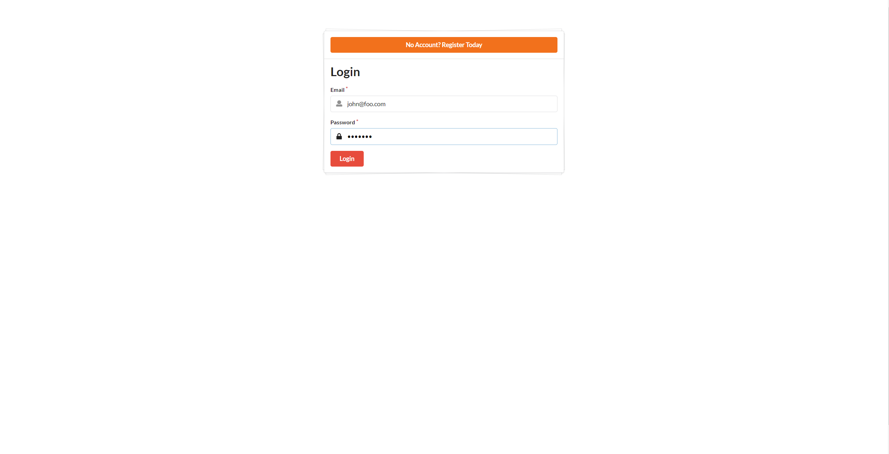
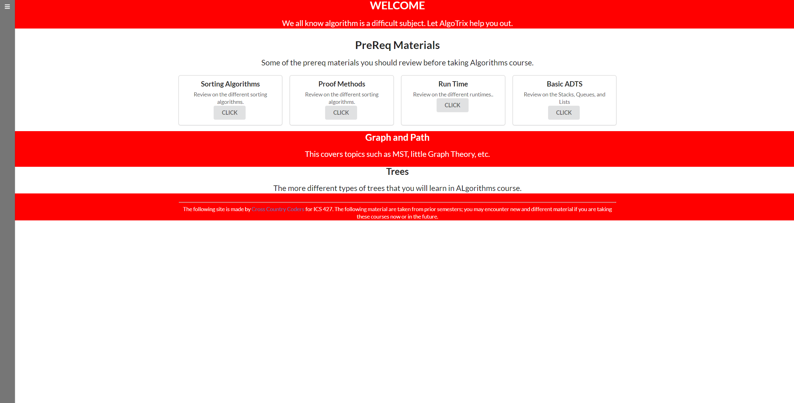
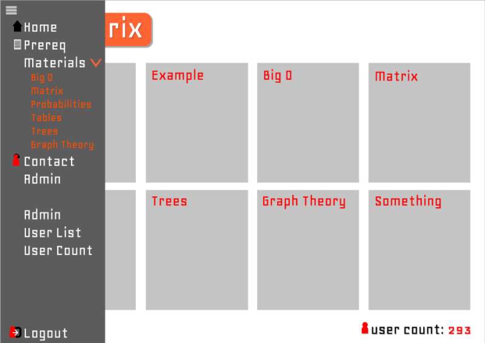
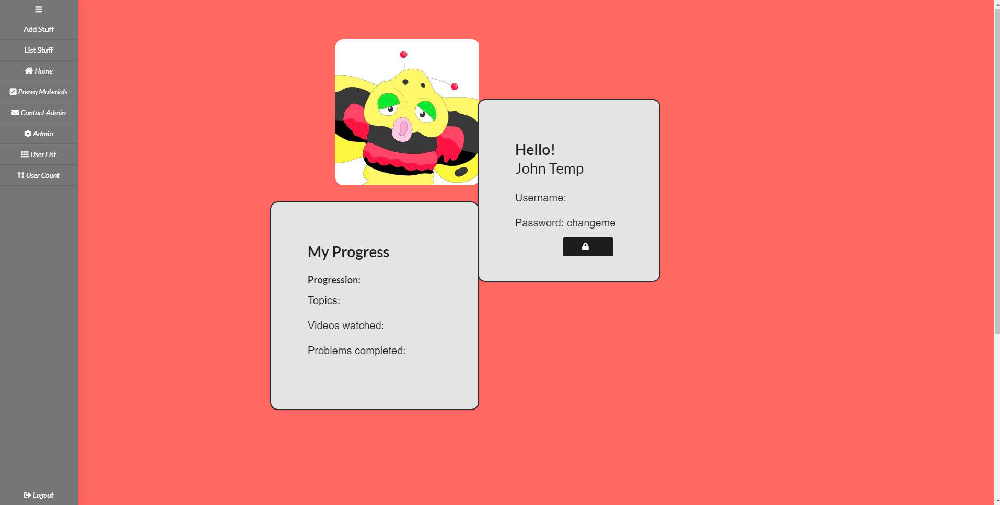
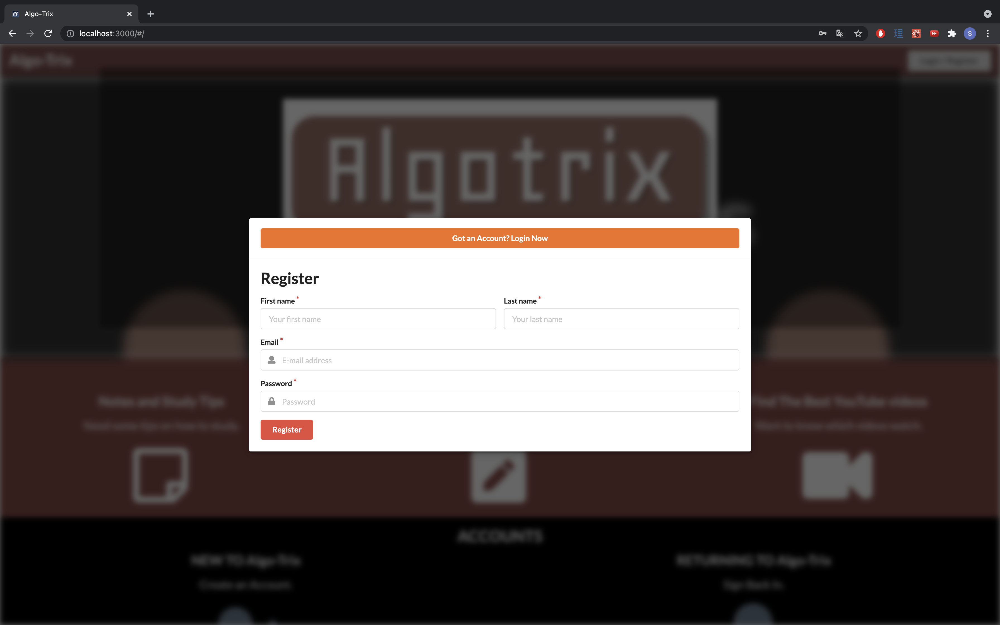
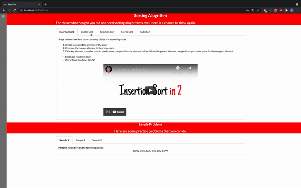
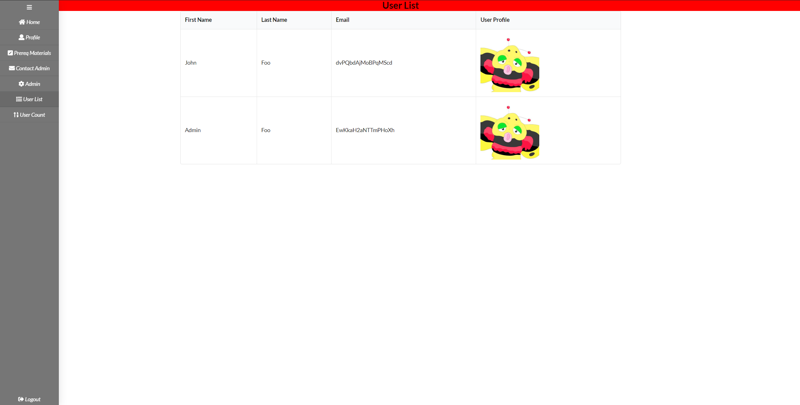
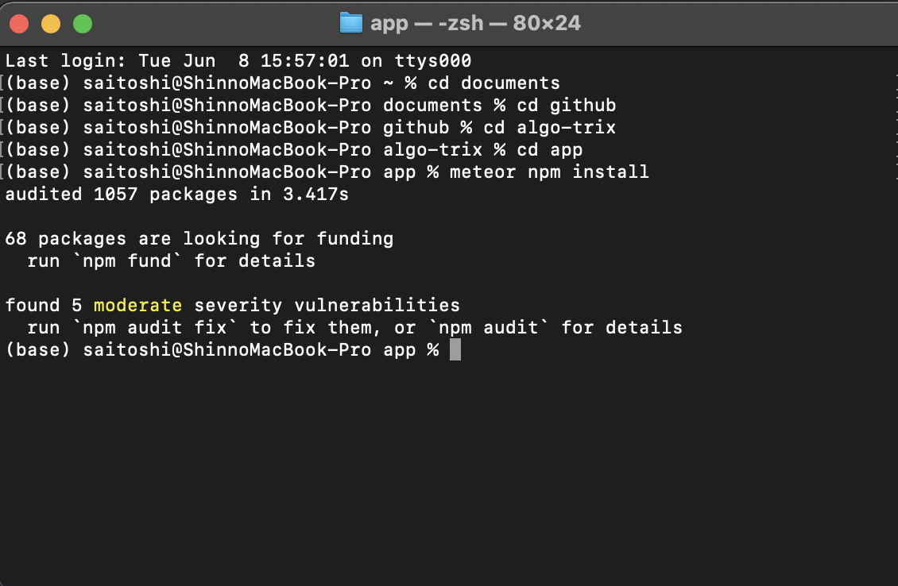
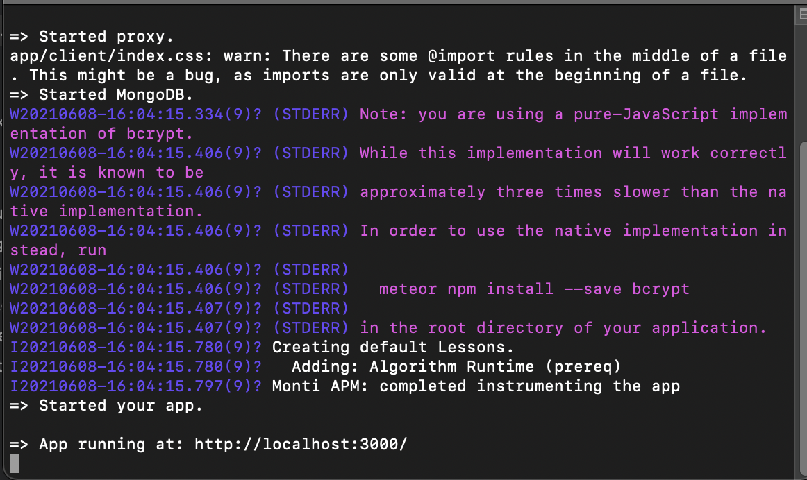

<h2> Cross Country Coders </h2>

<h2> Table Of Contents </h2>
* [OVERVIEW](#overview)
* [PROJECT](#project)
* [USER GUIDE](#user-guide)
* [PEER REVIEW](#user-review)
* [DEVELOPER'S GUIDE](#develop's-guide)
* [TEAM MEMBERS](#team-members)

## OVERVIEW
The application Algo-Trix provides college or high school students with additional assistance to Algorithms outside of a textbook. It contains a list of different topics with mini explanation and study tips. It will also contain some sample problems and example problems.

* Landing Page

 
The landing page, is the first page that users will see when the visit the website. It will contain all of the topics covered in ICS 311.
* Log In Page
  
  If a user already has an account they can re-join using the log in page.
* Home Page
  
   
  This is the home page, it will display all the problems the user can do while logged in.
* Navbar
  
   
  This is our navbar to help users find the page they are looking for.
  
  We also added a 2-step sign out popup.
* Sign Out Page
  
  This is our simple sign out page, more will be added in the future.
* Profile Page
  
This is our profile page where users can see their progression as well as edit their profile and change their password.
* Register Page

Otherwise if they do not have an account they can register by using the first name, last name, email, password and optionally an image.
* Problem and Explanation Page

The application will contain a brief explanation and some rundown of sample problems for each topic covered in a typical Algorithms course.  
On the bottom there will be a tabbed component with example problems that a modal page will pop up for solutions.
* Admin User List
  
If the specific user has a role of an admin, they can take a look at the user list that contains the first name, last name, and email but not the password for security purposes.

## Project
Here is a <a href ="https://github.com/cross-country-coders/algo-trix/projects/1">link</a> to the Project Board filled with different issues worked on.  
<b>Accomplished Progress</b>
<ol>
 <li> <b>Week 1 (May 24)</b> </li>
 <ul>
  <li> Creating the GitHub organization repository and web page using GitHub pages. </li>
  <li> Mock Up Design: Creating the different mock up designs for each paage of the application. </li>
  <li> Using Intellij, started making the mockup designs into real Javascript code and creating the collection necessary for UserInfo login.</li>
  <li> Creating the different Navigation Bars one for the Landing Page (where the users are not logged in) and the Side Navigation Bar used once logged in. </li>
  <li> Created the Sign in and the Register Page. </li>
 </ul>
 <li> <b>Week 2 (May 31)</b> </li>
 <ul>
 <li> Created a User Profile Page.</li>
 <li> Created Admin Related pages, such as the User List where the Admin can see each user's first name, last name, email, and profile image. </li>
 <li> Making tune ups to the Side Nav Bar in terms of CSS. </li>
 <li> Created a list of fake but believable users. </li>
 <li> Created a collection that stores the different possible lessons. </li>
 </ul>
<li> <b> Week 3 (June 7)</b></li>
<ul>
<li> Created a Model for the Login/Register instead of it havin it as a whole individual page.</li>
<li> Create a Edit Profile Page </li>
<li> Created the Sorting Algorithm Pages and the Proof Pages.</li>
</ul>
<li><b>Week 4 (June 14)</b></li>
<ul>
<li>Created the MST Page</li>
<li>Created the Single Shortest Path Page</li>
<li>Created the Basic ADT Page</li>
<li>Created the Introduction to Graph Page</li>
<li>Created the Contact Page</li>
<li>Created the Growth Page</li>
</ul>
</ol>
<b>Pending Progress</b>
<ul>
<li>Create the other lesson pages filled with topics and recommended videos.</li>
<li>Update the design of NavBar to have a clean side dropdown option.</li>
<li>Create a Contact Page that is theoretically functional.</li>
</ul>

## Developer's Guide

 Here is a brief step to step on how to run the application.

<ol>
<li>To download the source code please head over to the <a href="https://github.com/cross-country-coders/algo-trix">repository page</a> and download the master branch.</li>
<li>Then, install meteor in the app folder using this following command: <code>meteor npm install</code>
  </li>
<li>Then type in <code>meteor npm run start</code> then go to the following link <code> http://localhost:3000</code> to see the application running locally in your computer. </li>
  
</ol>

## Team Members 
Here it lists all the team members of the Cross Country Coders and the contributions that they have made for this project. 

* [Jerome Gallego](https://alohajerome.github.io/)
  * Contact: gallego6@hawaii.edu
  * Interests: Software Engineering
  * New Completion (June 13)  
    * Created the Profile Page
    * Fixed erros with Profile Page
    * Created the Mock Up designs for the Contact Page
    * Fixed most of errors on the mock-up version of the Contact Page
  * Current (June 19)
    * Working on adding some information about why someone should contact the admin
  * Next (June 19)
    * Finding Problems that might be good on placing to the website. 
    
* [Christian Jensen](https://christianjensenv.github.io/)
  * Contact: cjensen6@hawaii.edu
  * Interests: Software Engineering, Video Game Development
  * New Completion (June 13):
    <ul>
    <li>Created the SideNav Bar Component for the Application</li>
    <li>Created the CSS Designs that applies for most of the pages</li>
    </ul>
  * Current (June 13)
    <ul>
    <li>Finding practice problems.</li>
    </ul>
  * Next (June 13)
    <ul>
    <li>Creating a simple level up system</li>
    </ul>
    
* [Jun Miao](https://junm1ao.github.io/)
   * Contact: junmiao@hawaii.edu
   * Interests: Software Engineering, Database Management, Mobile App Development
   * New Completion (June 19):
     * Created a stronger faker user generator system.
     * Created the Login/Register Modal.   
     * Fixed the User List Page for Admin to display the user count on the page itself     and the side nav bar
     * Fixed the Edit Profile Page into Modal.
     * Fixed the file and improved up on ESLint errors.
     * Created the Runtime Pre-req lesson page.
  * Current (June 19)
    * Creating Lesson Pages.
  * Next (June 19) 
    * Finding good sample problems to place on the lesson page.
* [Shinya Saito](https://saitoshi.github.io/)
  * Contact: saitoshi@hawaii.edu
  * Interests: Software Engineering, Mathematical Teaching, Japanese and English Translations, Design
  * New Completion (June 13)
    * Created the UserInfo Collection 
    * Create the Basic User Fake Generator 
    * Created the Landing Page 
    * Created the Sorting Algorithm Lesson Page 
    * Created the Proof Writing Lesson Page 
    * Created the Rough Contact Page
    * Created the Home Page when users login
  * Current (June 13)
    * Creating the PreReq Material Lesson Pages for Algorithms
  * Next (June 13)
    * Creating the Pages for the other lessons and topics covered in Algorithm
