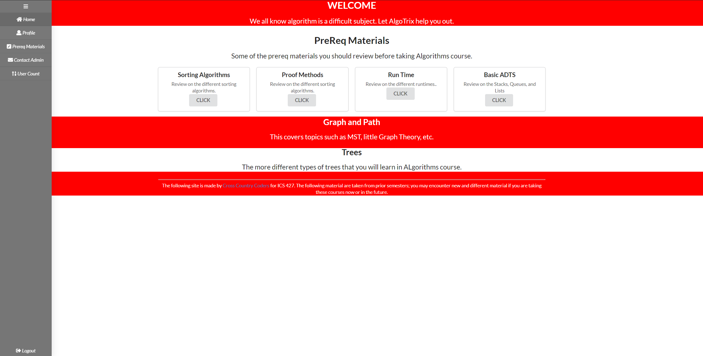
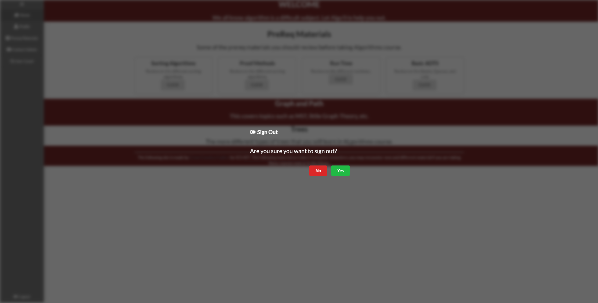

<h2> Cross Country Coders </h2>

<h2> Table Of Contents </h2>
* [OVERVIEW](#overview)
* [PROJECT](#project)
* [USER GUIDE](#user-guide)
* [PEER REVIEW](#user-review)
* [DEVELOPER'S GUIDE](#develop's-guide)
* [TEAM MEMBERS](#team-members)

## OVERVIEW
The application Algo-Trix provides college or high school students with additional assistance to Algorithms outside of a textbook. It contains a list of different topics with mini explanation and study tips. It will also contain some sample problems and example problems.

* Landing Page

 
The landing page, is the first page that users will see when the visit the website. It will contain all of the topics covered in ICS 311.
* Log In Page
  
  If a user already has an account they can re-join using the log in page.
* Home Page
  
   
  This is the home page, it will display all the problems the user can do while logged in.
* Navbar
  
   
  This is our navbar to help users find the page they are looking for.
  
  We also added a 2-step sign out popup.
* Sign Out Page
  
  This is our simple sign out page, more will be added in the future.
* Profile Page
  
This is our profile page where users can see their progression as well as edit their profile and change their password.
* Register Page

Otherwise if they do not have an account they can register by using the first name, last name, email, password and optionally an image.
* Problem and Explanation Page

The application will contain a brief explanation and some rundown of sample problems for each topic covered in a typical Algorithms course.  
On the bottom there will be a tabbed component with example problems that a modal page will pop up for solutions.
* Admin User List
  
If the specific user has a role of an admin, they can take a look at the user list that contains the first name, last name, and email but not the password for security purposes.

## Project 
Here is a <a href ="https://github.com/cross-country-coders/algo-trix/projects/1">link</a> to the Project Board filled with different issues worked on.  
<b>Accomplished</b>
<ol>
 <li> <b>Week 1 (May 24)</b> </li>
 <ul>
  <li> Creating the GitHub organization repository and web page using GitHub pages. </li>
  <li> Mock Up Design: Creating the different mock up designs for each paage of the application. </li>
  <li> Using Intellij, started making the mockup designs into real Javascript code and creating the collection necessary for UserInfo login.</li>
  <li> Creating the different Navigation Bars one for the Landing Page (where the users are not logged in) and the Side Navigation Bar used once logged in. </li>
  <li> Created the Sign in and the Register Page. </li>
 </ul>
 <li> <b>Week 2 (May 31)</b> </li>
 <ul>
 <li> Created a User Profile Page.</li>
 <li> Created Admin Related pages, such as the User List where the Admin can see each user's first name, last name, email, and profile image. </li>
 <li> Making tune ups to the Side Nav Bar in terms of CSS. </li>
 <li> Created a list of fake but believable users. </li>
 <li> Created a collection that stores the different possible lessons. </li>
 </ul>
 <b> Pending </b>
 <ul>
  <li> Creating the functionalities with the lesson and the landing page.</li>
  <li> Creating a fully functional Contact Page where the message will be sent to a Json file. </li>
  <li> Create a fully functional Edit Profile Page. </li>
 </ul>
</ol>

## Developer's Guide 

 Here is a brief step to step on how to run the application.

<ol>
<li>To download the source code please head over to the <a href="https://github.com/cross-country-coders/algo-trix">repository page</a> and download the master branch.</li>
<li>Then, install meteor in the app folder using this following command: <code>meteor npm install</code></li>
<li>Then type in <code>meteor npm run start</code> then go to the following link <code> http://localhost:3000</code> to see the application running locally in your computer. </li>
</ol>

## Team Members
* [Jerome Gallego](https://alohajerome.github.io/)
  * Contact: gallego6@hawaii.edu
  * Interests: Software Engineering

* [Christian Jensen](https://christianjensenv.github.io/)
  * Contact: cjensen6@hawaii.edu
  * Interests: Software Engineering, Video Game Development
* [Jun Miao](https://junm1ao.github.io/)
   * Contact: junmiao@hawaii.edu
   * Interests: Software Engineering, Database Management, Mobile App Development
* [Shinya Saito](https://saitoshi.github.io/)
  * Contact: saitoshi@hawaii.edu
  * Interests: Software Engineering, Mathematical Teaching, Japanese and English Translations, Design
