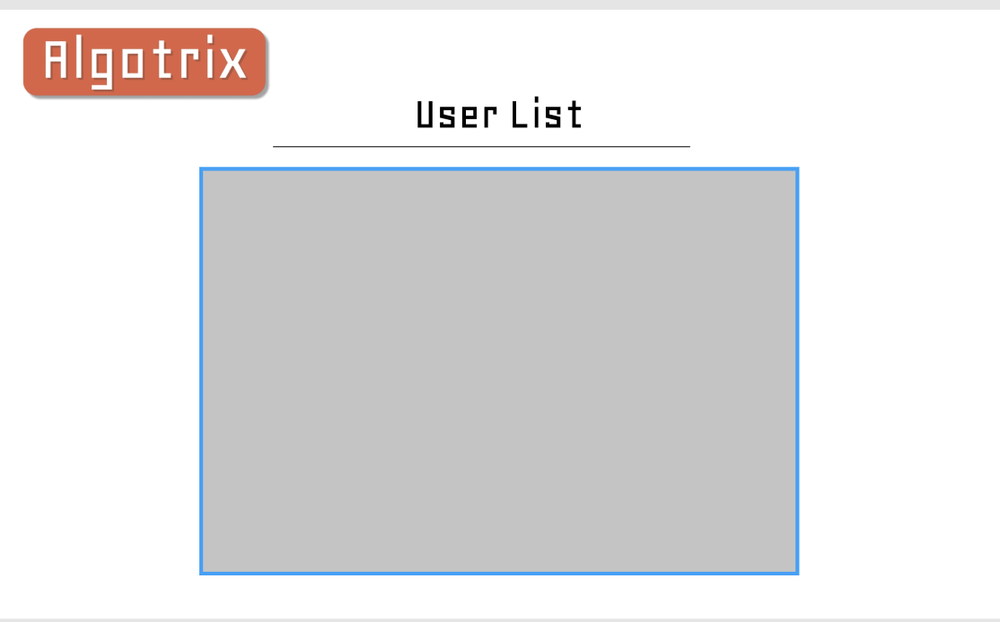

<h2> Cross Country Coders </h2>

<h2> Table Of Contents </h2>
* [OVERVIEW](#overview)
* [MILESTONES](#milestones)
* [USER GUIDE](#user-guide)
* [PEER REVIEW](#user-review)
* [DEVELOPER'S GUIDE](#develop's-guide)
* [TEAM MEMBERS](#team-members)

## OVERVIEW
The application Algo-Trix provides college or high school students with additional assistance to Algorithms outside of a textbook. It contains a list of different topics with mini explanation and study tips. It will also contain some sample problems and example problems.

* Landing Page

 
The landing page, the first page that users will see when the visit the website. It will contain all of the topics covered in ICS 311.
* Log In Page

If a user already has an account they can re-join using the log in page.
* Register Page

Otherwise if they do not have an account they can register by using the first name, last name, email, password and optionally an image.
* Problem and Explanation Page

The application will contain a brief explanation and some rundown of sample problems for each topic covered in a typical Algorithms course.  
On the bottom there will be a tabbed component with example problems that a modal page will pop up for solutions.
* Admin User List
  
If the specific user has a role of an admin, they can take a look at the user list that contains the first name, last name, and email but not the password for security purposes.

## MILESTONES
For each week, milestones were created using GitHub's project <i>kanban</i> such that each person in the team will select on a issue to work on.
 
<ol>
<li><a href="https://github.com/cross-country-coders/cross-country-coders/projects/1">Milestone 1</a></li>
For Milestone 1, the mock up design for the application was made and after that each person using Meteor, Javascript, and React created the application. Additionally, we also talked about the security features of the application itself. 
</ol>

## Team Members
* [Jerome Gallego](https://alohajerome.github.io/)
  * Contact: gallego6@hawaii.edu

* [Christian Jensen](https://christianjensenv.github.io/)
  * Contact: cjensen6@hawaii.edu
  * Interests: Software Engineering, Video Game Development
* [Jun Miao](https://junm1ao.github.io/)
   * Contact: junmiao@hawaii.edu
   * Interests: Software Engineering, Database Management, Mobile App Development
* [Shinya Saito](https://saitoshi.github.io/)
  * Contact: saitoshi@hawaii.edu
  * Interests: Software Engineering, Mathematical Teaching, Japanese and English Translations, Design
